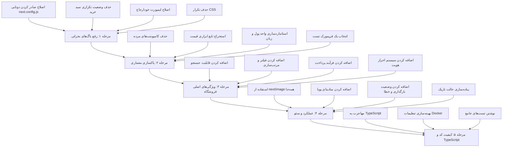

# کلون دیجی‌کالا — برنامه بهبود

## نمای کلی پروژه

یک **کلون دیجی‌کالا** (پلتفرم فروشگاه آنلاین ایرانی) ساخته شده با **Next.js 14** (App Router)، **React 18**، **Tailwind CSS** و **Zustand**. چیدمان راست‌به‌چپ (RTL) برای زبان فارسی. در حال حاضر فقط فرانت‌اند با داده‌های ثابت و بدون بک‌اند واقعی.

---

## 🔴 باگ‌های بحرانی

### ۱. مدیریت تکراری سبد خرید

- **فایل‌ها:** [`context/CartContext.js`](context/CartContext.js) و [`store/cart-store.js`](store/cart-store.js)
- [`Navbar`](components/Navbar.js:5) و [`ProductCardNew`](components/ProductCardNew.js:6) از **Zustand** استفاده می‌کنند
- [`layout.js`](app/layout.js:21) اپلیکیشن رو با **CartProvider** (React Context) می‌پیچه
- دو وضعیت مستقل سبد خرید باعث جدا شدن داده‌ها و ایجاد باگ می‌شود
- **راه‌حل:** حذف کامل [`CartContext.js`](context/CartContext.js) و استفاده فقط از Zustand

### ۲. صادر کردن دوتایی در next.config.js

- **فایل:** [`next.config.js`](next.config.js)
- اولین `module.exports` (خط ۱۱) تنظیمات `reactStrictMode` و دامنه‌های تصویر رو ست می‌کنه
- دومین `module.exports` (خط ۲۴) اون رو بازنویسی می‌کنه و فقط هدرهای امنیتی رو نگه می‌داره
- **راه‌حل:** ادغام هر دو در یک صادر کردن واحد

### ۳. ایمپورت داینامیک خودارجاع

- **فایل:** [`heavy-component.jsx`](components/heavy-component.jsx)
- کامپوننت خودش رو ایمپورت می‌کنه (`@/components/heavy-component`) و باعث لوپ بی‌نهایت می‌شه
- **راه‌حل:** حذف یا تبدیل به یک کامپوننت واقعی

---

## 🟠 مشکلات معماری

### ۴. کامپوننت‌های بلااستفاده / مرده

| فایل                                                         | مشکل                                        |
| ------------------------------------------------------------ | ------------------------------------------- |
| [`MegaMenu.js`](components/MegaMenu.js)                      | فقط یک div خالی، هیچ‌جا ایمپورت نشده        |
| [`SearchBar.js`](components/SearchBar.js)                    | در Navbar استفاده نشده                      |
| [`ProductCard.js`](components/ProductCard.js)                | نسخه قدیمی، جایگزین شده با `ProductCardNew` |
| [`CartItem.js`](components/CartItem.js)                      | استفاده نشده — صفحه سبد خرید JSX داخلی داره |
| [`Slider.js`](components/Slider.js)                          | فقط دوباره `HeroSlider` رو صادر می‌کنه      |
| [`CategoryList.js`](components/CategoryList.js)              | فقط دوباره `CategorySection` رو صادر می‌کنه |
| [`error-boundary.jsx`](components/error-boundary.jsx)        | به هیچ مسیری متصل نشده                      |
| [`loading-skeleton.jsx`](components/ui/loading-skeleton.jsx) | هیچ‌جا استفاده نشده                         |

**راه‌حل:** حذف کدهای مرده یا ادغام صحیح این کامپوننت‌ها.

### ۵. قوانین CSS تکراری

- **فایل:** [`globals.css`](app/globals.css)
- خطوط ۵-۲۳ و ۲۵-۳۱ قوانین یکسان رو دوبار تعریف می‌کنند (container, line-clamp-2, body background)
- **راه‌حل:** حذف تکرارهای CSS

### ۶. تداخل فریمورک تست

- هم **Jest** ([`jest.config.cjs`](jest.config.cjs)) و هم **Vitest** ([`vitest.config.js`](vitest.config.js)) تنظیم شده‌اند
- [`cart-store.test.js`](__tests__/cart-store.test.js) فقط یک تست الکی داره (`expect(true).toBe(true)`)
- فقط [`cartContext.test.js`](__tests__/cartContext.test.js) تست‌های واقعی داره
- **راه‌حل:** یک فریمورک انتخاب کنید (Vitest پیشنهاد می‌شه) و تست‌های واقعی بنویسید

---

## 🟡 ویژگی‌های ناموجود فروشگاه آنلاین

### ۷. بدون لایه داده واقعی

- تمام محصولات ثابت در [`lib/data.js`](lib/data.js) — فقط ۶ محصول
- فایل `.env.example` شامل `DATABASE_URL` و `JWT_SECRET` هست ولی هیچ‌چیز از اونا استفاده نمی‌کنه
- **پیشنهاد:** اضافه کردن لایه API با Next.js Route Handlers + دیتابیس (Prisma + PostgreSQL یا SQLite)

### ۸. بدون سیستم احراز هویت

- [`login/page.js`](app/login/page.js) فقط `alert()` صدا می‌زنه — بدون احراز هویت واقعی
- **پیشنهاد:** ادغام NextAuth.js یا احراز هویت مبتنی بر JWT با Route Handlers

### ۹. بدون فیلتر / مرتب‌سازی محصولات

- صفحات دسته‌بندی فقط تمام محصولات اون دسته رو نشون میدن
- بدون فیلتر قیمت، مرتب‌سازی بر اساس قیمت/امتیاز، بدون جستجو
- [`SearchBar.js`](components/SearchBar.js) وجود داره ولی متصل نشده

### ۱۰. بدون فرآیند پرداخت

- صفحه سبد خرید آیتم‌ها رو نشون میده ولی دکمه «ادامه خرید» نداره
- بدون اطلاعات ارسال، پرداخت، و تأیید سفارش

### ۱۱. ناسازگاری واحد پول / زبان

- بعضی جاها `$` نشون میدن (مثلاً [`ProductCard.js`](components/ProductCard.js:11)، [`cart/page.js`](app/cart/page.js:28))
- بقیه جاها `تومان` (مثلاً [`ProductCardNew.js`](components/ProductCardNew.js:22))
- ترکیب انگلیسی و فارسی در کل رابط کاربری
- **راه‌حل:** استانداردسازی به فارسی با واحد تومان، یا اضافه کردن i18n مناسب

---

## 🔵 عملکرد و سئو

### ۱۲. عدم استفاده از کامپوننت Image در Next.js

- تمام تصاویر از تگ `` خام استفاده می‌کنند (مثلاً [`ProductCard.js`](components/ProductCard.js:8)، [`HeroSlider.js`](components/HeroSlider.js:31))
- بدون بهینه‌سازی خودکار، بارگذاری تنبل و اندازه‌های واکنش‌گرا
- **راه‌حل:** جایگزینی با کامپوننت `<Image>` از `next/image`

### ۱۳. بدون متادیتای پویا / سئو

- فقط [`layout.js`](app/layout.js:6) متادیتای ثابت داره
- صفحات جزئیات محصول و دسته‌بندی بدون `<title>` یا تگ‌های Open Graph
- بدون `sitemap.xml` یا `robots.txt`
- **راه‌حل:** اضافه کردن `generateMetadata` به مسیرهای پویا

### ۱۴. بدون وضعیت‌های بارگذاری / خطا

- هیچ فایل `loading.js` در هیچ بخش مسیری وجود نداره
- هیچ فایل `error.js` در هیچ بخش مسیری وجود نداره
- بدون `not-found.js` در سطح اپلیکیشن
- [`loading-skeleton.jsx`](components/ui/loading-skeleton.jsx) وجود داره ولی استفاده نشده
- **راه‌حل:** اضافه کردن loading.tsx و error.tsx مناسب به بخش‌های مسیری

### ۱۵. بدون پشتیبانی از حالت تاریک

- [`ThemeToggle.js`](components/ThemeToggle.js) کلاس `dark` رو تغییر میده ولی:
  - [`tailwind.config.cjs`](tailwind.config.cjs) حالت `darkMode` رو فعال نکرده
  - هیچ کلاس رنگی حالت تاریک در هیچ‌جا وجود نداره
- **راه‌حل:** اضافه کردن `darkMode: 'class'` به تنظیمات Tailwind و اضافه کردن کلاس‌های dark

---

## 🟣 کیفیت کد

### ۱۶. بدون TypeScript (با وجود tsconfig.json)

- [`tsconfig.json`](tsconfig.json) وجود داره با `strict: false`
- تمام فایل‌های منبع `.js` / `.jsx` هستند
- TypeScript نصب شده ولی استفاده نمیشه
- **پیشنهاد:** مهاجرت تدریجی به `.tsx` / `.ts` و فعال‌سازی `strict: true`

### ۱۷. منطق محاسبه قیمت تکراری

- محاسبه قیمت `(price * (1 - discount / 100))` تکرار شده در:
  - [`ProductCard.js`](components/ProductCard.js:11)
  - [`ProductCardNew.js`](components/ProductCardNew.js:9)
  - [`CartItem.js`](components/CartItem.js:8)
  - [`cart/page.js`](app/cart/page.js:5)
  - [`products/[id]/page.js`](app/products/[id]/page.js:11)
- **راه‌حل:** استخراج به یک تابع ابزاری مشترک مثل `lib/price.js`

### ۱۸. بدون اعتبارسنجی Props

- بدون PropTypes، بدون اینترفیس TypeScript
- کامپوننت‌ها props رو بدون هیچ اعتبارسنجی قبول می‌کنند
- **راه‌حل:** مهاجرت به TypeScript یا حداقل اضافه کردن PropTypes

### ۱۹. Docker بهینه نیست

- [`Dockerfile`](Dockerfile) از ساخت چند مرحله‌ای استفاده نمی‌کنه
- بدون فایل `.dockerignore` — `node_modules` و `.next` کپی می‌شن
- **راه‌حل:** اضافه کردن ساخت چند مرحله‌ای و `.dockerignore`

---

## ترتیب پیشنهادی اولویت‌ها

---

## جزئیات مراحل

### مرحله ۱ — رفع باگ‌های بحرانی ✅ (انجام شد)

1. ✅ ادغام `module.exports` دوتایی در [`next.config.js`](next.config.js) به یک آبجکت تنظیمات واحد
2. ✅ حذف [`context/CartContext.js`](context/CartContext.js) و ارائه‌دهنده‌اش از [`layout.js`](app/layout.js) — استفاده از Zustand همه‌جا
3. ✅ اصلاح یا حذف [`heavy-component.jsx`](components/heavy-component.jsx)
4. ✅ حذف قوانین CSS تکراری در [`globals.css`](app/globals.css)

### مرحله ۲ — پاکسازی معماری

1. حذف کامپوننت‌های بلااستفاده: `MegaMenu.js`، `SearchBar.js`، `ProductCard.js`، `CartItem.js`، `Slider.js`، `CategoryList.js`
2. استخرج تابع `getDiscountedPrice(price, discount)` به `lib/price.js`
3. استانداردسازی تمام قیمت‌ها به تومان و تمام متن‌های رابط کاربری به فارسی
4. حذف تنظیمات Jest، نگه‌داری Vitest؛ نوشتن تست‌های واقعی برای Zustand store

### مرحله ۳ — ویژگی‌های اصلی فروشگاه آنلاین

1. اتصال `SearchBar` برای فیلتر واقعی محصولات
2. اضافه کردن نوار کناری فیلتر (محدوده قیمت، امتیاز) و منوی کشویی مرتب‌سازی (قیمت، امتیاز، جدیدترین)
3. ساخت فرآیند پرداخت: اطلاعات ارسال → پرداخت → تأیید سفارش
4. ادغام NextAuth.js با ارائه‌دهنده credentials

### مرحله ۴ — عملکرد و سئو

1. جایگزینی تمام `` با `<Image>` از `next/image`
2. اضافه کردن `generateMetadata` به [`products/[id]/page.js`](app/products/[id]/page.js) و صفحات دسته‌بندی
3. اضافه کردن `loading.js` و `error.js` به هر بخش مسیری
4. فعال‌سازی `darkMode: 'class'` در تنظیمات Tailwind و اضافه کردن کلاس‌های حالت تاریک
5. اضافه کردن تولید `sitemap.xml` و `robots.txt`

### مرحله ۵ — کیفیت کد

1. مهاجرت فایل‌ها به TypeScript (`.tsx` / `.ts`)
2. فعال‌سازی `strict: true` در `tsconfig.json`
3. بهینه‌سازی Dockerfile با ساخت چند مرحله‌ای، اضافه کردن `.dockerignore`
4. نوشتن تست‌های جامع برای کامپوننت‌ها و store
